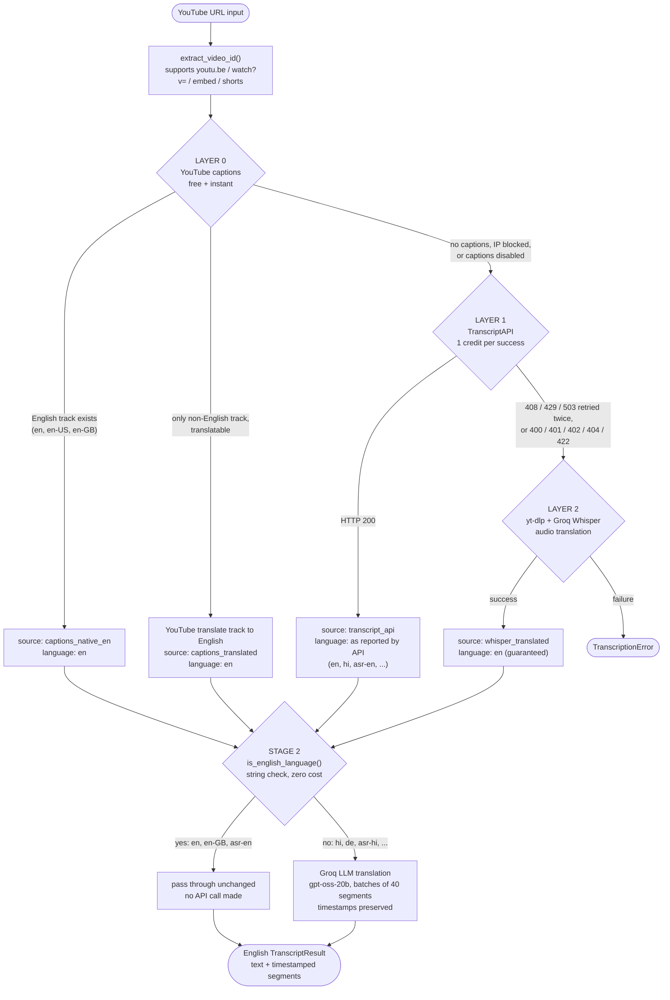
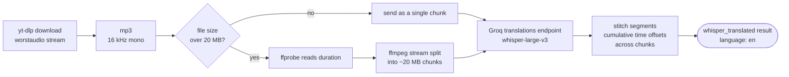
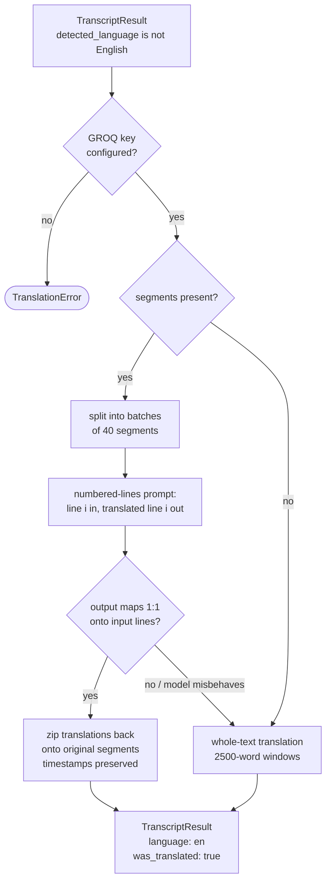
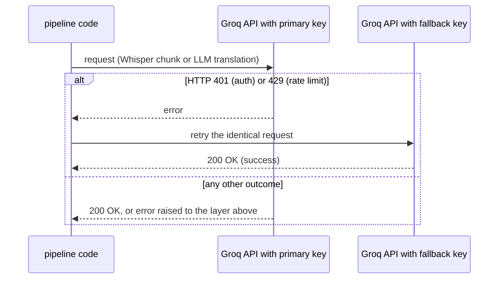

# Transcript Pipeline

**Module:** `src/transcript_pipeline` — the stage of the Multiagent YouTube Notes Generator that turns a raw YouTube URL into a guaranteed-English transcript with timestamped segments, ready for the agent modules to consume.

---

## Table of Contents

1. [Overview](#1-overview)
2. [Pipeline at a Glance](#2-pipeline-at-a-glance)
3. [End-to-End Flow Diagram](#3-end-to-end-flow-diagram)
4. [Stage 1 — Transcription: The Three-Layer Fallback Chain](#4-stage-1--transcription-the-three-layer-fallback-chain)
5. [Layer 2 Internals — Audio Chunking](#5-layer-2-internals--audio-chunking)
6. [Stage 2 — Translation](#6-stage-2--translation)
7. [API Key Rotation](#7-api-key-rotation)
8. [Data Model](#8-data-model)
9. [Error Handling Reference](#9-error-handling-reference)
10. [Cost Profile](#10-cost-profile)
11. [Configuration Reference](#11-configuration-reference)
12. [Usage](#12-usage)
13. [Design Decisions & Rationale](#13-design-decisions--rationale)
14. [Verified Behavior](#14-verified-behavior)

---

## 1. Overview

The pipeline has two stages, living side by side in one package:

| Stage | File | Entry point | Guarantee |
|---|---|---|---|
| 1. Transcription | `transcription.py` | `get_transcript(url)` | Returns a transcript — cheapest available source first |
| 2. Translation | `translation.py` | `ensure_english(result)` / `get_english_transcript(url)` | Returns an **English** transcript |

The rest of the application should only ever call:

```python
from src.transcript_pipeline import get_english_transcript
```

The pipeline is built around one principle: **spend nothing when you can, spend a little when you must, and never let the caller deal with a non-English transcript.**

---

## 2. Pipeline at a Glance

| Layer | Mechanism | Speed | Cost | Fires when |
|---|---|---|---|---|
| **L0** | YouTube's own caption tracks (`youtube-transcript-api`) | Instant | Free | Almost always |
| **L1** | TranscriptAPI (`transcriptapi.com`) | ~50 ms | 1 credit / success | L0 unavailable (no captions, IP blocked) |
| **L2** | Audio download + Groq Whisper (`whisper-large-v3`) | Seconds–minutes | Groq audio usage | No captions exist anywhere |
| **Stage 2** | Groq LLM translation (`openai/gpt-oss-20b`) | Fast | Groq LLM tokens | Only when L1 returns a non-English transcript |

---

## 3. End-to-End Flow Diagram



### Explaining the diagram

- **Top of the graph:** any YouTube URL is normalized to an 11-character video ID by `extract_video_id()`. Every subsequent layer works with the bare ID.
- **Layer 0 (leftmost decision):** the pipeline first asks YouTube itself for caption tracks. Three outcomes are possible: an English track exists (best case — free and instant), a non-English track exists that YouTube can auto-translate to English (still free), or nothing usable exists (no captions, the video blocks caption listing, or YouTube throttles the request — the exact failures the paid API exists to absorb). Any failure quietly hands control to Layer 1 — a `None` return, never an exception.
- **Layer 1:** a single authenticated GET to TranscriptAPI. Success returns segments plus a `language` field — which is the **only path in the whole pipeline that can produce a non-English transcript** (e.g., a Hindi video whose captions only exist in Hindi). Every failure mode — retryable (408/429/503, retried up to twice with backoff) or permanent (bad key, out of credits, video not found) — logs a warning and falls through to Layer 2.
- **Layer 2:** the expensive last resort. The audio is downloaded, split into upload-sized chunks, and each chunk is sent to Groq's Whisper **translations** endpoint, which outputs English regardless of the spoken language. If this layer fails too, the pipeline gives up with a single, well-described `TranscriptionError` — the only error type callers need to catch for transcription.
- **Stage 2 (the `is_english_language()` diamond):** the "classifier" of this system is deliberately a plain string check — every layer *reports* the language of the text it returns, so no model, human, or extra API call is ever needed to detect language. English results (including auto-generated English, `asr-en`) flow straight to the output at zero cost. Non-English results (only possible via Layer 1) are machine-translated by the Groq LLM while keeping every segment's original timestamps.
- **The output node:** agents always receive the same contract — `TranscriptResult` with English `text`, a `segments` list with `start`/`end`/`text`, a `source` tag saying which layer won, and a `was_translated` flag.

---

## 4. Stage 1 — Transcription: The Three-Layer Fallback Chain

### Layer 0 — Free YouTube captions (`_try_captions`)

Uses `youtube-transcript-api` against YouTube directly. Resolution order within the layer:

1. Look for a manually-created or auto-generated **English** track (`en`, `en-US`, `en-GB`).
2. Otherwise, take the first available track and ask YouTube's own translation layer for an English version (`track.translate("en")`) — still free, still instant.
3. Otherwise return `None` (captions disabled, video unavailable, IP blocked, or no translatable track).

> **Why it matters:** this layer handles the overwhelming majority of real videos at literally zero cost, and even translates non-English videos for free via YouTube's own machine translation.

### Layer 1 — TranscriptAPI (`_try_transcriptapi`)

A paid service that proxies YouTube caption extraction, designed to survive the IP blocking that eventually hits direct scrapers like Layer 0.

- `GET https://transcriptapi.com/api/v2/youtube/transcript` with `video_url=<id>&format=json&include_timestamp=true`
- Bearer-token auth; 30-second timeout; **1 credit charged only on a successful 200**
- Transient failures (network errors, HTTP 408/429/503) are retried up to **2 times** with exponential backoff, honouring the `Retry-After` header when present
- Permanent failures (see table below) are logged and fall through to Layer 2 — never retried

| HTTP status | Meaning | Action |
|---|---|---|
| 200 | Success | Parse and return |
| 400 / 422 | Bad request / invalid video ID | Log, fall to Layer 2 |
| 401 | Invalid API key | Log, fall to Layer 2 |
| 402 | Out of credits | Log, fall to Layer 2 |
| 404 | No captions available | Log, fall to Layer 2 — the case Whisper exists for |
| 408 / 429 / 503 | Timeout / rate limit / unavailable | Retry up to 2×, then fall to Layer 2 |
| Network error | Timeout / connection failure | Retry up to 2×, then fall to Layer 2 |

### Layer 2 — Groq Whisper audio translation (`_try_whisper`)

Only reached when a video has **no captions at all** (music videos, raw vlogs). The audio itself is transcribed:

1. `yt-dlp` downloads the worst (smallest) audio stream, converted to **MP3, 16 kHz mono** — Whisper's native format, roughly a tenth the size of typical audio.
2. Files larger than ~20 MB are split (see next section).
3. Each chunk is sent to Groq's **`audio/translations`** endpoint (`whisper-large-v3`), which returns **English text regardless of the source language** — translation and transcription happen in one pass.
4. Chunk results are stitched, with each chunk's timestamps offset by the cumulative duration of the chunks before it.

Videos longer than `MAX_AUDIO_SECONDS` (default 30 hours) are rejected with a clear error rather than attempted.

---

## 5. Layer 2 Internals — Audio Chunking



### Explaining the diagram

Chunking solves two deployment constraints at once:

1. **Groq's 25 MB upload cap** on the free tier — chunks target ~20 MB to leave headroom.
2. **Small ephemeral disks on free-tier hosts** (Render etc.) — long videos can produce large audio files that must not be processed whole.

The splitter never loads audio into RAM: it probes the file's duration with `ffprobe`, computes `seconds-per-chunk` from the file's actual bytes-per-second, then slices with `ffmpeg -c copy` (stream copy — near-instant, no re-encode). This design also avoids the memory blow-up that decoded-file processing would cause on RAM-limited instances.

---

## 6. Stage 2 — Translation



### Explaining the diagram

The stage begins with a zero-cost gate: if the transcript is already English it is returned **unchanged** (the same object, no API call) — this covers nearly every video in practice, because Layer 0 prefers English captions and Layer 2 always outputs English. Only Layer 1 can deliver a non-English transcript.

For those rare cases, translation uses the Groq LLM (`openai/gpt-oss-20b` by default):

- **Segment-aligned path (preferred):** segments are grouped into batches of 40 and sent as *numbered lines*. The model must return exactly the same numbers in the same order, which the code validates strictly — each output line must map one-to-one onto an input line. On success, translations are zipped back onto the original segments so **every timestamp survives the translation**, and downstream agents see a fully aligned English transcript.
- **Whole-text fallback:** if the model's output cannot be aligned (merged/skipped lines, formatting drift), the stage degrades gracefully — translating the raw text in 2,500-word windows. The English text is still produced; only the segment texts stay in the original language, and a warning is logged. This makes translation failures a *degradation*, never a crash.

---

## 7. API Key Rotation

Every Groq call in the pipeline — Whisper chunks **and** LLM translation — uses the same primary→fallback key rotation:



### Explaining the diagram

The two most common operational Groq failures are a **rate limit** (429 — the free tier's hourly audio/LLM caps) and an **auth problem** (401 — a revoked or mistyped key). Both are transient in the sense that a second key fixes them instantly. The rotation only triggers on 401/429; all other errors (bad request, model errors) propagate immediately, since retrying those with a different key would only repeat a deterministic failure.

This behaviour is identical in both places it is needed:
- `transcription.py` → `_transcribe_chunk_with_fallback` (Whisper chunks)
- `translation.py` → `_chat_completion_with_fallback` (every LLM call)

---

## 8. Data Model

| Type | Field | Meaning |
|---|---|---|
| `TranscriptSegment` | `start: float` | Segment start time (seconds) |
| | `end: float` | Segment end time (seconds) |
| | `text: str` | Segment text |
| `TranscriptResult` | `text: str` | Full transcript text (always English after stage 2) |
| | `segments: list[TranscriptSegment]` | Timestamped segments |
| | `source: TranscriptSource` | Which layer won (see below) |
| | `detected_language: Optional[str]` | Language of `text` — `"en"`, `"hi"`, `"asr-en"`, … |
| | `video_id: str` | 11-character YouTube ID |
| | `was_translated: bool` | `True` if stage 2 ran the LLM translation |

`TranscriptSource` values:

| Value | Produced by |
|---|---|
| `captions_native_en` | Layer 0 — native English captions |
| `captions_translated` | Layer 0 — YouTube's own translation of a foreign track |
| `transcript_api` | Layer 1 — TranscriptAPI |
| `whisper_translated` | Layer 2 — Groq Whisper translations endpoint |

> **Convention:** `detected_language` always describes the language of the returned *text*, not the video's original language. Layer 0's translated captions and Layer 2's translation output are English by construction, so they report `"en"` — and the translation stage can trust the field unconditionally.

---

## 9. Error Handling Reference

| Exception | Raised by | Meaning for the caller |
|---|---|---|
| `ValueError` | `extract_video_id()` | The URL contains no recognizable YouTube video ID |
| `TranscriptionError` | `get_transcript()` | All three layers failed (or Layer 2 hit a hard limit) — message describes the last failure |
| `TranslationError` | `ensure_english()` | A non-English transcript could not be translated (no Groq key configured, or the LLM failed) |

Layer 0 and Layer 1 never raise — they return `None` internally and hand over to the next layer. The pipeline surfaces at most **one** terminal exception per stage.

---

## 10. Cost Profile

| Path | When it happens | Cost |
|---|---|---|
| Layer 0 | Video has any usable captions | **Free** |
| Layer 1 | Layer 0 unavailable | **1 credit**, charged only on HTTP 200 — failures are free |
| Layer 2 | No captions exist anywhere | Groq Whisper usage, proportional to audio length |
| Translation | Layer 1 returned non-English | Groq LLM tokens, proportional to transcript length |
| Language detection | Every run | **Free** — reported by the layers, checked as a string |

---

## 11. Configuration Reference

All values are read from `.env` via `python-dotenv`.

| Variable | Default | Used by | Purpose |
|---|---|---|---|
| `Youtube_to_Transcript_API_KEY` | — | Layer 1 | TranscriptAPI bearer token |
| `GROQ_API_KEY` | — | Layer 2 + translation | Primary Groq key |
| `FALLBACK_GROQ_API_KEY` | — | Layer 2 + translation | Rotated in on 401/429 |
| `GROQ_WHISPER_MODEL` | `whisper-large-v3` | Layer 2 | Whisper model (best accuracy) |
| `GROQ_LLM_MODEL` | `openai/gpt-oss-20b` | Translation | `openai/gpt-oss-120b` for higher quality |
| `TRANSCRIPTAPI_TIMEOUT` | `30` | Layer 1 | Request timeout, seconds |
| `TRANSCRIPTAPI_MAX_RETRIES` | `2` | Layer 1 | Retries for 408/429/503/network errors |
| `MAX_CHUNK_SIZE_MB` | `20` | Layer 2 | Audio chunk target size |
| `MAX_AUDIO_SECONDS` | `108000` (30 h) | Layer 2 | Hard cap on video duration |
| `TRANSLATION_SEGMENTS_PER_BATCH` | `40` | Translation | Segments per LLM request |
| `TRANSLATION_WORDS_PER_WINDOW` | `2500` | Translation | Window size in the text fallback |

---

## 12. Usage

**The one call the agents should make:**

```python
from src.transcript_pipeline import get_english_transcript

result = get_english_transcript("https://www.youtube.com/watch?v=dQw4w9WgXcQ")

result.text              # full English transcript
result.segments          # [TranscriptSegment(start, end, text), ...]
result.source            # which layer resolved it
result.detected_language # "en" (always, after stage 2)
result.was_translated    # False in this case (captions were already English)
```

**Granular access, if a caller wants the raw (possibly non-English) transcript:**

```python
from src.transcript_pipeline import (
    get_transcript,      # stage 1 only
    ensure_english,      # stage 2 only
    TranscriptionError,
    TranslationError,
)
```

**Expected failure handling:**

```python
from src.transcript_pipeline import get_english_transcript
from src.transcript_pipeline import TranscriptionError, TranslationError

try:
    result = get_english_transcript(url)
except TranscriptionError as exc:
    ...  # video truly has no transcribable content
except TranslationError as exc:
    ...  # non-English transcript but translation unavailable
```

---

## 13. Design Decisions & Rationale

| Decision | Why |
|---|---|
| Free captions before the paid API | Layer 0 handles ~99% of videos at zero cost; Layer 1 exists specifically to absorb YouTube's IP blocking, which is why it is the fallback rather than the primary |
| TranscriptAPI *before* Whisper | Caption extraction (even paid) is cheaper, faster, and quota-friendly compared to downloading and transcribing audio |
| Whisper via the **translations** endpoint | Guarantees English output in one pass; the historical code called the transcriptions endpoint, which silently returned the *source* language — a bug this pipeline fixes |
| No language classifier | Every layer reports the language of its own output, so detection is a string comparison — deterministic, free, and unfailable |
| LLM translation over Whisper for text | Text→text translation with an LLM is dramatically cheaper than audio re-transcription, and preserves the already-extracted timestamps |
| ffmpeg stream-splitting for chunks | Respects Groq's 25 MB upload cap and free-tier disk limits *without* loading audio into RAM (stream copy, no re-encode) |
| Numbered-lines translation format | Strict 1:1 line mapping is trivially validatable, and a validation failure degrades to the whole-text path instead of corrupting timestamps |
| Key rotation on 401/429 only | These are the only errors a second key can fix; anything else is deterministic and retrying with another key would just repeat the failure |

---

## 14. Verified Behavior

Every layer and branch below was executed live during development (Rick Astley video, synthetic Hindi transcript, synthetic oversized audio):

| # | Test | Result |
|---|---|---|
| 1 | Language-check unit cases (`en`, `en-GB`, `asr-en`, `hi`, `asr-hi`, `None`, …) | PASS |
| 2 | Layer 0 free captions via `get_transcript` | PASS — resolved free, no credits |
| 3 | Layer 1 live TranscriptAPI call | PASS — `language=en`, 61 segments |
| 4 | English passthrough (`ensure_english`) | PASS — same object returned, zero cost |
| 5 | Hindi → English LLM translation | PASS — 3/3 segments aligned, timestamps preserved |
| 6 | Layer 2 Whisper audio translation | PASS — English output with timestamped segments |
| 7 | ffmpeg chunking on a 4.6 MB synthetic file | PASS — 5 chunks, sizes and durations exact |
| 8 | Key rotation with sabotaged primary key | PASS — 401 → fallback key → 200 OK → translation delivered |

---

*Maintained alongside `src/transcript_pipeline/`. Update this document whenever a layer's behaviour, configuration, or cost profile changes.*
